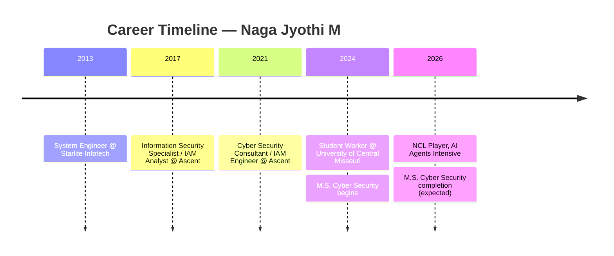

<div align="center">


# 🛡️ Naga Jyothi M 

### IAM Engineer | Cloud Security | GRC | AI Security Enthusiast


[](./resume/Naga_Jyothi_M_Resume.pdf)
[](https://www.linkedin.com/in/mahanj-tech)
[](https://github.com/mahanj-tech)
[](https://your-portfolio-site.example.com)


</div>

---

## 🎯 Professional Introduction

Welcome! This repository is my personal **knowledge hub** — not a software project, but a curated, continuously updated archive of everything behind my cybersecurity career: my résumé, certifications, IAM/GRC/cloud security notes, interview preparation material, cheat sheets, and a running log of what I'm learning next.

If you're a recruiter, hiring manager, or fellow security professional, this repo is designed to give you a fast, organized view of my background and skill depth in one place.

---

## 👩‍💻 About Me

I'm an **IAM Engineer and Cybersecurity Consultant** with **7+ years** of experience across identity governance, privileged access management, and compliance-heavy enterprise environments (SOX, HIPAA, PCI-DSS, GDPR, NIST 800-53). I've supported **800+ users**, led the migration of **50+ applications** to modern federation platforms, and reduced audit findings by **40%** through disciplined access governance.

I'm currently completing an **M.S. in Cyber Security** at the University of Central Missouri, and expanding into **AI/agent security** — exploring how identity and governance principles apply to autonomous AI systems.

📍 Warrensburg, Missouri, USA · ✉️ naganetworkpro@gmail.com

---

## 📄 Resume

<div align="center">

[](./resume/Naga_Jyothi_M_Resume.pdf)

</div>

| Detail | Info |
|---|---|
| 📌 Title | IAM Engineer & Cybersecurity Consultant |
| 📆 Experience | 7+ years |
| 🌍 Location | Warrensburg, Missouri, USA |
| 📧 Email | naganetworkpro@gmail.com |
| 📱 Phone | (660) 580-5887 |

---

## 💼 LinkedIn Profile

<div align="center">

[](https://www.linkedin.com/in/mahanj-tech)

</div>

> IAM Engineer | Identity Governance · Cloud Security · SOC 2 · ITGC · Cyber Security · HIPAA | PingFederate · Okta · SAML · OAuth · Zero Trust | AI Enthusiast

---

## 📜 Certifications

<details>
<summary><strong>Click to expand full certification list (10+)</strong></summary>

| Certification / Credential | Issuer | Status |
|---|---|---|
| Identity and Access Administrator Associate (SC-300) | Microsoft | ✅ Completed |
| CyberArk Trustee | CyberArk | ✅ Completed |
| Cybersecurity Essentials (LFC108) | Linux Foundation | ✅ Completed |
| ISC2 Candidate | ISC2 | ✅ Active |
| Security Awareness Analyst Simulation | Mastercard (Forage) | ✅ Completed |
| Malware Incident Response Simulation | Telstra (Forage) | ✅ Completed |
| Risk & Credit Analysis Simulation | Goldman Sachs (Forage) | ✅ Completed |
| Cybersecurity Analyst Job Simulation | Tata (Forage) | ✅ Completed |
| Cyber Skyline Skills Development Event | Cyber Skyline | ✅ Completed |
| AI Skills Fest 2026 | — | ✅ Completed |
| National Cyber League (NCL) 2026 Competitor | NCL | ✅ Completed |
| 5-Day AI Agents Intensive | Google | ✅ Completed |
| Women4Cyber Operation Iron Shield Participant | Women4Cyber | ✅ Completed (2025) |

</details>


---

## 🎓 Education

| Degree | Institution | Duration |
|---|---|---|
| M.S., Computer & Information Systems Security / Auditing / Information Assurance | University of Central Missouri, USA | Jan 2024 – May 2026 |
| B.Tech, Electronics & Communications Engineering | JNTU Kakinada, India | Aug 2009 – May 2013 |

---

## 🛡️ Cybersecurity Learning Resources

<details>
<summary><strong>Expand resource index</strong></summary>

- 📘 NIST CSF & NIST 800-53 study notes
- 📘 Threat modeling & risk assessment references
- 📘 Zero Trust architecture summaries
- 📘 Vulnerability management workflows
- 📘 Incident response playbooks (add your files under `/resources/cybersecurity`)

</details>

## ☁️ Cloud Security Resources

<details>
<summary><strong>Expand resource index</strong></summary>

- ☁️ AWS IAM, Identity Center, Security Hub, GuardDuty, CloudTrail notes
- ☁️ Azure AD / Microsoft Entra ID & Defender for Cloud references
- ☁️ GCP IAM & CIEM fundamentals
- ☁️ Cloud security posture management (CSPM) checklists (add files under `/resources/cloud-security`)

</details>

## 🔐 IAM Resources

<details>
<summary><strong>Expand resource index</strong></summary>

- 🔑 Okta, PingFederate/PingAccess/PingOne configuration guides
- 🔑 CyberArk & BeyondTrust PAM runbooks (vaulting, CPM, OPM)
- 🔑 SAML 2.0 / OAuth 2.0 / OIDC / SCIM protocol references
- 🔑 JML (Joiner-Mover-Leaver) lifecycle templates
- 🔑 Access recertification & SoD remediation guides (add files under `/resources/iam`)

</details>

## 📚 GRC Resources

<details>
<summary><strong>Expand resource index</strong></summary>

- 📗 SOX, HIPAA, PCI-DSS, GDPR compliance mapping notes
- 📗 NIST 800-53v5 & CSF control mapping templates
- 📗 ISO 27001 & SOC 2 audit prep checklists
- 📗 RACI charts for governance accountability (add files under `/resources/grc`)

</details>

## 📈 SOC & SIEM Learning Materials

<details>
<summary><strong>Expand resource index</strong></summary>

- 📊 Splunk query & dashboard notes
- 📊 Log correlation and alert triage workflows
- 📊 Detection engineering references (add files under `/resources/soc-siem`)

</details>

---

## 📂 Interview Preparation PDFs

| Resource | Description |
|---|---|
| `iam-interview-questions.pdf` | Common IAM/PAM interview Q&A |
| `grc-compliance-scenarios.pdf` | Scenario-based GRC/audit questions |
| `cloud-security-interview-prep.pdf` | AWS/Azure/GCP IAM interview prep |
| `behavioral-star-answers.pdf` | STAR-format behavioral answers |

*(Place actual files under `/interview-prep`)*

## 📖 Cheat Sheets

| Sheet | Topic |
|---|---|
| `saml-oauth-oidc-cheatsheet.md` | Federation protocol quick reference |
| `nist-800-53-controls.md` | Control family quick reference |
| `splunk-spl-cheatsheet.md` | SPL query syntax |
| `linux-cli-security.md` | Linux commands for security ops |

## 📝 Notes

Personal study notes organized by topic under `/notes` — covering IAM platform configs, compliance frameworks, and AI agent security research.

## 🧪 Hands-on Labs

| Lab | Stack | Focus |
|---|---|---|
| Red Team Sandbox | Kali Linux, Metasploit, Nmap | Recon, exploitation, MITM, post-exploitation |
| IAM Migration Lab | OAM → PingAccess | Federation cutover practice |
| Vertex AI Agent Lab | Google ADK, MCP | Secure multi-agent orchestration |

## 🎥 Learning Videos

*(Add curated playlists / links under `/videos` — e.g., conference talks, platform tutorials, CTF walkthroughs)*

## 📑 Books & Research Papers

*(Add reading list under `/books` — recommended IAM, GRC, and Zero Trust references)*

---

## 🛠️ Tools I Practice

<div align="center">


</div>

## 💻 Technical Skills

| Category | Skills |
|---|---|
| **IAM & PAM** | Okta, Active Directory, Microsoft Entra ID, Azure AD, LDAP, SailPoint, CyberArk, BeyondTrust, OPM, CPM, RBAC, PAM, PIM, JML, IGA, SoD, SSO, MFA |
| **Identity Protocols** | SAML 2.0, OAuth 2.0, OIDC, WS-Federation, Kerberos, SCIM |
| **Directory & Federation** | ADCS, ADFS, LDAP, PingFederate, SiteMinder, Tivoli Identity Management |
| **Cloud Security** | AWS IAM, AWS Identity Center, Azure AD, GCP IAM, CIEM, Security Hub, GuardDuty, CloudTrail, Defender for Cloud |
| **Compliance & Governance** | SOC 2, HIPAA, SOX, ISO 27001, PCI-DSS, GDPR, NIST CSF, NIST 800-53, CIS Controls, ITGC |
| **Security Operations** | Splunk, Audit Logging, Threat Monitoring, Incident Response, Vulnerability Management, ServiceNow |
| **Automation & Scripting** | PowerShell, Python, SQL, PL/SQL, REST APIs, Bash |

---

## 📅 Learning Roadmap

```mermaid
flowchart LR
    A[✅ IAM & PAM Foundations] --> B[✅ Federation Protocols<br/>SAML/OAuth/OIDC]
    B --> C[✅ Compliance & Audit<br/>SOX/HIPAA/NIST]
    C --> D[✅ Cloud IAM<br/>AWS/Azure/GCP]
    D --> E[🔄 M.S. Cyber Security<br/>2024-2026]
    E --> F[🔄 AI Agent Security<br/>Google ADK/MCP]
    F --> G[⏳ CISSP / CCSP]
    G --> H[⏳ Agentic AI Red-Teaming]

    style A fill:#2E8B57,color:#fff
    style B fill:#2E8B57,color:#fff
    style C fill:#2E8B57,color:#fff
    style D fill:#2E8B57,color:#fff
    style E fill:#1F6FEB,color:#fff
    style F fill:#1F6FEB,color:#fff
    style G fill:#94a3b8,color:#fff
    style H fill:#94a3b8,color:#fff
```



---

## 🏆 Achievements

| Achievement | Detail |
|---|---|
| 🎯 Enterprise users supported | 800+ (full JML lifecycle) |
| 🎯 Entitlements reviewed per cycle | 1,200+ |
| 🎯 Excessive privilege reduction | 28% |
| 🎯 SoD conflicts remediated per cycle | 60+ |
| 🎯 Audit findings reduction | 40% |
| 🎯 Applications migrated (OAM → PingAccess) | 50+ |
| 🎯 PingFederate upgrades led | 6→7, 7→8, 9.0/10 |
| 🎯 National Cyber League | 2026 Competitor |

## 🌟 Volunteer Experience

| Role | Organization | Year |
|---|---|---|
| Operation Iron Shield Participant | Women4Cyber | 2025 |

---

## 📊 Career Timeline



---

## 📂 Repository Folder Structure

```
📦 career-portfolio
 ┣ 📂 resume/
 ┃ ┗ 📄 Naga_Jyothi_M_Resume.pdf
 ┣ 📂 certifications/
 ┃ ┗ 🖼️ certificate images / PDFs
 ┣ 📂 resources/
 ┃ ┣ 📂 cybersecurity/
 ┃ ┣ 📂 cloud-security/
 ┃ ┣ 📂 iam/
 ┃ ┣ 📂 grc/
 ┃ ┗ 📂 soc-siem/
 ┣ 📂 interview-prep/
 ┣ 📂 cheat-sheets/
 ┣ 📂 notes/
 ┣ 📂 labs/
 ┣ 📂 videos/
 ┣ 📂 books/
 ┗ 📄 README.md
```

---

## 🤝 Connect With Me

<div align="center">

[](https://www.linkedin.com/in/mahanj-tech)
[](https://github.com/mahanj-tech)
[](mailto:naganetworkpro@gmail.com)
[](https://your-portfolio-site.example.com)

</div>

---

## ⭐ Support

If this resource hub was helpful for your own IAM/GRC/cloud security learning journey, consider starring the repo!

<div align="center">


</div>

---

<div align="center">
<sub>Maintained by Naga Jyothi M · Last updated July 2026</sub>
</div>
